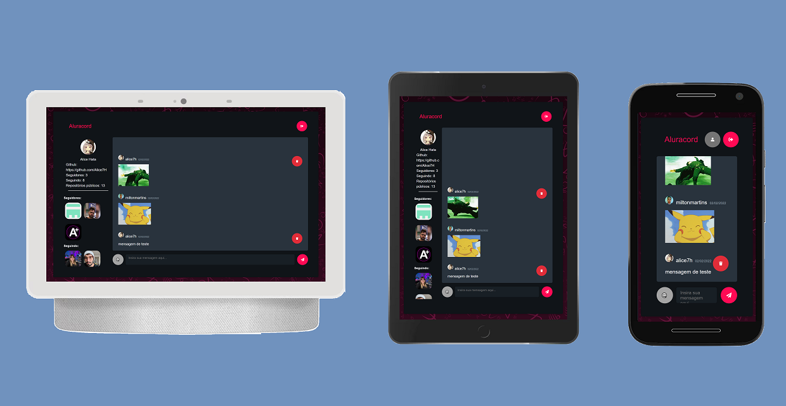

<h1 align="center">
  
</h1>

# Aluracord

O projeto Aluracord é um chat que foi criado durante a Imersão React da Alura.

<p align="center">
 <a href="#tecnologias">Tecnologias</a> • 
 <a href="#pré-requisitos">Pré-requisitos</a> •
 <a href="#configuração-do-supabase">Configuração do Supabase</a> •
 <a href="#rodando-o-aluracord">Rodando o Aluracord</a>
</p>

## Tecnologias

As seguintes ferramentas/bibliotecas foram usadas na construção do projeto:

- [Node.js](https://nodejs.org/en/)
- [React](https://pt-br.reactjs.org/)
- [Next](https://nextjs.org/)
- [Supabase](https://supabase.com)
- [SkynexUI](https://skynexui.dev/)
- [react-hot-toast](https://react-hot-toast.com/)

## Pré-requisitos

- [Git](https://git-scm.com)
- [Node.js](https://nodejs.org/en/)
- um editor de código, como o [VSCode](https://code.visualstudio.com/)
- [Supabase] (https://app.supabase.io/)

## Configuração do Supabase

- Entre com uma conta do GitHub.
- Crie um novo projeto.
- Crie uma nova tabela com o nome de "mensagens".
- Adicione os campos "id, create_at, de, texto" na tabela.

- Crie um arquivo '.env.local' na pasta raiz do projeto com as seguintes informações do supabase: NEXT_PUBLIC_SUPABASE_URL e NEXT_PUBLIC_SUPABASE_ANON_KEY.

### Chave e API URL

1. Vá para a seção "Settings".
2. Clique em "API" no menu lateral.
3. Encontre a chave "anon" na parte "Project API keys" da página.
4. Encontre sua API URL na parte de "Config" da página.
5. Copie a chave ao NEXT_PUBLIC_SUPABASE_ANON_KEY do arquivo de ambiente.
6. Copie a chave ao NEXT_PUBLIC_SUPABASE_URL do arquivo de ambiente.

### Habilitar o supabase realtime

1. Vá para a seção "Database".
2. Clique em "Replication" no menu lateral.
3. Controle quais eventos de banco de dados são enviados, habilitando com o botão de alternância Inserir/Atualizar/Excluir.
4. Controle quais tabelas transmitem alterações clicando em "Source" e alternando as tabelas.

## Rodando o Aluracord

```bash
# Clone este repositório
$ git clone <https://github.com/Alice7H/aluracord.git>

# Acesse a pasta do projeto no terminal/cmd
$ cd aluracord

# Instale as dependências
$ npm install
#ou
$ yarn install

# Execute a aplicação em modo de desenvolvimento
$ npm run dev
#ou
$ yarn dev

# O projeto inciará na porta:3000 - acesse <http://localhost:3000>
```
